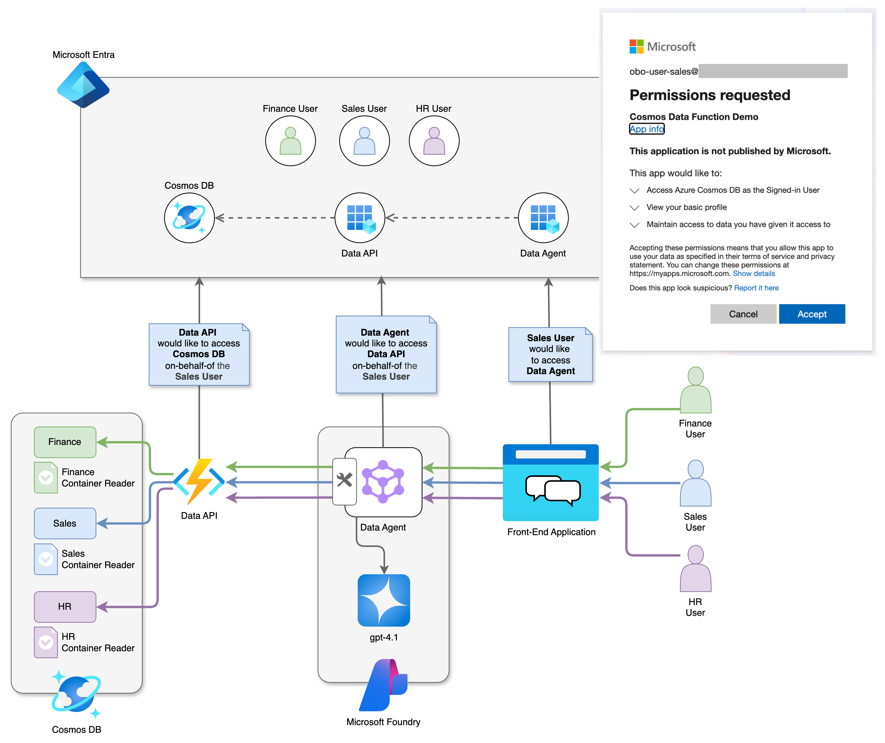

# Foundry Agent with On-Behalf-Of Cosmos DB Access Demo

> [!WARNING]
> This repository is a work in progress. Documentation is partial and incomplete.

This repository demonstrates how a Microsoft Foundry agent enforces container-level access control in Cosmos DB using On-Behalf-Of (OBO) authentication.

