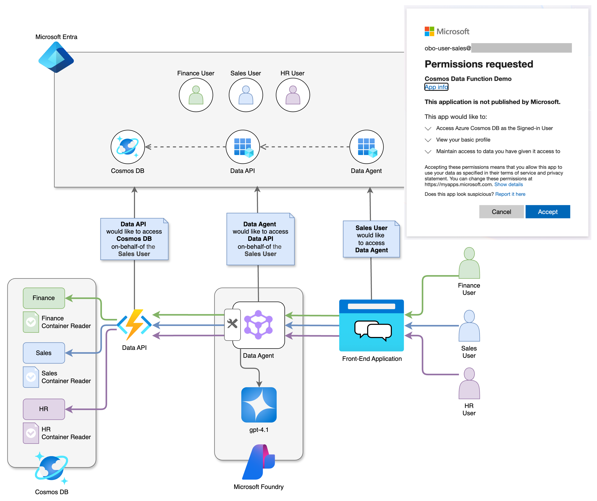

# Foundry Agent with On-Behalf-Of Cosmos DB Access Demo

> [!WARNING]
> This repository is a work in progress. Documentation is partial and incomplete.

This repository demonstrates how a Microsoft Foundry agent enforces container-level access control in Cosmos DB using On-Behalf-Of (OBO) authentication.

## OBO Demo Slides

A demo (in the form of pdf slides) can be found here: [OBO-Demo-Slides.pdf](./docs/OBO-Demo-Slides.pdf).

## OBO JWT Token Validation & Exchanges

OBO token validation & exchange has been implemented manually in both the Data API and Data Agent layers.

### Data API

Implemented as a dotnet Azure Function

- JWT Token Validation code: [TokenValidationService.cs](./src/CosmosDataFunction/Services/TokenValidationService.cs)
- OBO Token Exchange code: [OboTokenProvider.cs](./src/CosmosDataFunction/Services/OboTokenProvider.cs)

### Data Agent

Implemented as a Python agent using [Microsoft Agent Framework](https://learn.microsoft.com/en-us/agent-framework/overview/?pivots=programming-language-python) and [Agent Server](https://learn.microsoft.com/en-us/python/api/overview/azure/ai-agentserver-core-readme?view=azure-python-preview)

- JWT Token Validation code: [obo.py > `validate_token(bearer_token: str) -> Optional[str]`](./src/agent-with-local-tools/obo.py#L74)
- OBO Token Exchange code: [obo.py > `def get_obo_token(user_token: str, scopes: list[str]) -> str`](./src/agent-with-local-tools/obo.py#L181)
