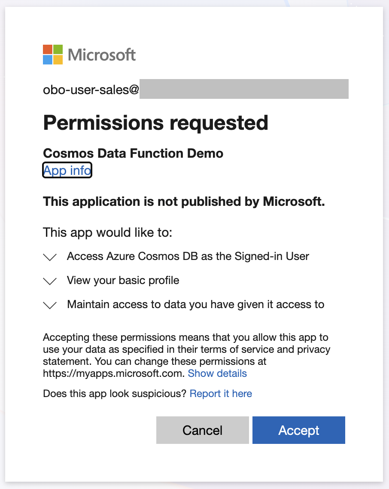

## The Identity Problem Hidden Inside Agent Architectures

Every AI agent architecture follows the same surface arc: a user types a
question, an LLM reasons about it, a tool fires off, and the answer lands
neatly in the chat. The data retrieval step is treated as a solved problem.

Behind the scenes the agent may be calling a backend service with its
own credentials, credentials that are entirely independent of the human who
asked the question. The agent authenticates as itself. It holds whatever access
it was provisioned with. When that access is broad enough to satisfy every
possible user question, every user inherits that same breadth. A sales
representative can ask the agent to summarise the HR compensation data, and the
agent, acting on its own token, has no reliable way to know it should refuse.

The OAuth 2.0 On-Behalf-Of (OBO) flow exists specifically to close this gap. It
allows a service to exchange a user's delegated token for a downstream token,
carrying the user's identity forward without the user ever needing to
re-authenticate. Applied carefully across an agent stack, it produces a system
where the database itself enforces who can read what, and no layer in between
can silently bypass that enforcement.

This post walks through how that pattern works in practice using Microsoft
Foundry, an Azure Function acting as a Data API, and Azure Cosmos DB.

## Why Agents Make Identity Harder, Not Easier

Traditional web applications have a predictable execution model. A user clicks a
button, a specific HTTP request fires, a known piece of code runs, and the
identity context is threaded through a well-understood middleware stack. OAuth
libraries were designed around this model. Propagating a user token is
straightforward because the call graph is deterministic.

AI agents are different in two important ways.

First, the call graph is non-deterministic. The language model decides at
runtime which tools to call, in what order, and with what arguments. There is no
compile-time guarantee that a particular tool invocation carries the user's
identity. If the tool implementation forgets to pass the token, the agent
silently falls back to service-level credentials. No error. No warning. Just
over-privileged data access.

Second, agents are stateful over a conversation but stateless at the function
boundary. Each tool call is essentially an isolated function invocation. The
thread of execution that the LLM orchestrates does not automatically carry HTTP
headers or ambient authentication context the way a web framework middleware
chain would. The developer has to wire that up deliberately.

These two properties together mean that OBO in an agent context is an explicit
architectural decision, not an automatic consequence of doing OAuth correctly.

> TODO: include an example of "jailbreaking" an agent by prompting.
> This demonstrates why we need to deterministically enforce this behavior.

## The Architecture

This pattern is structured across three tiers, each performing its own OBO
operation.

> TODO: replace this with a real diagram

```text
User (Browser)
    │  ① User authenticates via Entra ID → receives JWT
    ▼
Front-End Application (SPA)
    │  ② Sends user JWT in Authorization header to agent
    ▼
Foundry Agent (Python / Agent Server)
    │  ③ Validates incoming JWT, exchanges it for a Function-scoped OBO token
    ▼
Data API (Azure Function, .NET 8)
    │  ④ Validates the OBO token, exchanges it for a Cosmos-scoped OBO token
    ▼
Azure Cosmos DB
       ⑤ Evaluates RBAC: does this user's identity have read access to this container?
```

Each hop in the chain validates the token it received and uses it to acquire a
narrower token for the next downstream resource. Cosmos DB enforces container-
level RBAC using the identity that ultimately arrives. If the user has not been
granted the Cosmos built-in data reader role on a specific container, the
database returns a 403. The agent surfaces that as "you do not have access to
this data." No application-layer allow-list can be circumvented.

## How OBO Tokens Flow Through a Non-Deterministic Agent

The key challenge is step 3. When the user's request arrives, the raw
`Authorization` header with the user's JWT is captured and injected into the
agent tool implementations. This is the critical design point: the user's identity is
captured at the request boundary, not passed as a tool argument by the model.
Because the LLM is non-deterministic, you cannot rely on it to forward a
security token correctly on every call. Anchoring the token in middleware
means the identity propagates regardless of what the model does.

> TODO: include a diagram showing the deterministic flow of the identity

The tool itself then validates the incoming user token and exchanges it for a
Function-scoped OBO token:

```python
async def query_data_on_behalf_of_user(container: str, query: str | None = None,
                                        bearer_token: str = None):
    # Validate the user's JWT and acquire an OBO token scoped to the Function API
    oid, resource_token = validate_and_get_obo_token(
        bearer_token, scopes=["api://<function-client-id>/user_impersonation"])

    headers = {
        "Content-Type": "application/json",
        "Authorization": f"Bearer {resource_token}",
    }
    # Call the Azure Function with the OBO token
    response = await client.post(api_url, json={"containerName": container}, headers=headers)
```

The `validate_and_get_obo_token` function handles both validation and
exchange in one step. Validation confirms the JWT signature using Entra ID's
published JWKS endpoint. Exchange uses MSAL's `acquire_token_on_behalf_of`
with the user assertion:

```python
def get_obo_token(user_token: str, scopes: list[str]) -> str:
    app = ConfidentialClientApplication(
        client_id=CLIENT_ID,
        client_credential=CLIENT_SECRET,
        authority=f"https://login.microsoftonline.com/{TENANT_ID}",
    )
    result = app.acquire_token_on_behalf_of(user_assertion=token, scopes=scopes)
    if "access_token" not in result:
        raise OboTokenError(f"Failed to acquire OBO token: {result.get('error_description')}")
    return result["access_token"]
```

## The Data API: A Second OBO Hop

The Azure Function receives a token that is scoped to the Function's own API
(`api://<function-client-id>`). It validates this token, then performs its own
OBO exchange to get a Cosmos-scoped token. This second exchange is what makes
the Cosmos DB RBAC enforcement meaningful.

After JWT validation extracts the user's object ID (the `oid` claim), the Function
exchanges the token for one scoped to Cosmos:

> TODO: reduce to one code example for an OBO token exchange (no need for both C# and Python)

```csharp
public async Task<string> GetOboTokenAsync(string authorizationHeader)
{
    var userToken = authorizationHeader.Replace("Bearer ", "", StringComparison.OrdinalIgnoreCase).Trim();
    var userAssertion = new UserAssertion(userToken);

    var result = await _confidentialClient
        .AcquireTokenOnBehalfOf(new[] { "https://cosmos.azure.com/user_impersonation" }, userAssertion)
        .ExecuteAsync();

    return result.AccessToken;
}
```

Cosmos DB then evaluates whether the identity in that token holds the built-in
`Cosmos DB Built-in Data Reader` role on the requested container. No application
code makes that decision. The database does.

> TODO: example of a SQL role assignment.

## What the User Experiences

Consider a media production application where each show has separate Cosmos
containers for cast metadata, production schedules, and costume inventory. Users
are assigned read access to specific containers at the Cosmos RBAC level before
they ever open the chat interface.

When a user without production access asks the agent about shoot schedules,
Cosmos returns a 403. The agent surfaces this cleanly:

> "It looks like you don't have access to the production data for that show.
> I was able to retrieve the cast and show information, though."

> TODO: replace with a screenshot

This response is not the result of application-layer logic checking a
permission table. It is the direct consequence of Cosmos DB enforcing RBAC on
the user's own identity, propagated faithfully through two OBO exchanges and
one LLM reasoning step.

The consent experience is also meaningful. When a user logs in for the first
time, Entra ID presents an explicit consent screen.



The user consents to allow the application to access Azure Cosmos DB as the
signed-in user. This is the same consent model familiar from any OAuth-protected
application, applied to an AI agent context.

## Why This Pattern Matters

The value of the OBO pattern is not just access control. It is auditability.
Because the user's `oid` flows through every layer, every Cosmos DB read is
attributable to a specific user in Cosmos's diagnostic logs. No action is
performed by an anonymous service principal. When a compliance question arises,
the answer is in the logs: this user, at this time, read this data.

For AI agents operating in regulated industries such as healthcare, finance, or
legal services, this is not optional. Agents that act on their own credentials
create a single point of failure: compromising the agent's service principal
grants access to everything the agent can reach, for every user it serves. OBO
constrains the blast radius to the access that the currently authenticated user
already holds.

The non-determinism of the LLM reasoning step is what makes this pattern worth
building explicitly. You cannot rely on the model to always pass the right token
as a tool argument. Capturing the user's identity at the middleware layer, before
reasoning begins, and making it available as a fallback is the engineering
discipline that makes the security property hold even when the model's tool
invocation is incomplete.

## Summary

This architecture threads user identity through an entire agent stack using
OAuth 2.0 OBO at each service boundary:

- The front-end authenticates the user and forwards their JWT.
- The agent middleware captures the JWT before LLM reasoning begins.
- The tool validates the JWT and exchanges it for a Function-scoped OBO token.
- The Function validates that token and exchanges it for a Cosmos-scoped OBO token.
- Cosmos enforces container-level RBAC on the user's own identity.

No single layer trusts the previous one blindly. No application-layer allow-list
can be circumvented. The database is the authority on who can read what.

Applied to non-deterministic agents, the key insight is this: capture the user's
token at the request boundary, before the model runs, and hold it as a fallback
for every tool invocation. The model should not be trusted to propagate security
context reliably. That is an architecture decision, not a prompt.
